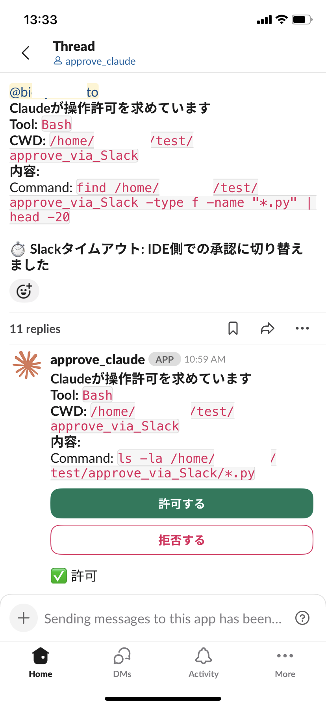

# claude-slack-approval



SSH先の Claude Code のツール実行承認を Slack から(スマホから VPN に繋がなくても)行えるようにします。サーバーをインターネットに公開する必要はありません。Slack で時間内に応答が無かった場合は、Claude Code 標準の IDE パーミッションプロンプトに自動でフォールバックします。

Claude Code が `Bash`、`Write`、`Edit`、`MultiEdit` を実行しようとすると、`PreToolUse` フックがあなたの Slack に **承認 / 拒否** ボタン付きの DM を送信します。フックは Slack の応答を **60 秒間** 待機します。時間内に応答が無い場合、Slack の DM は「IDE 側に切替」というメッセージに書き換えられてボタンが消え、Claude Code 通常の IDE パーミッションプロンプトが表示されるので、SSH 先から承認できます。Slack との通信は Socket Mode(送信側 WebSocket)を使うため、ホストは **受信ポート、公開ドメイン、ngrok、TLS 証明書のいずれも必要ありません**。

## ハイブリッド承認フロー

```
PreToolUse フックが発火
        │
        ▼
ハード拒否 / 自動承認チェック  ─────►  確定(Slack DM は送らない)
        │
        ▼
Slack DM を送信([承認][拒否] ボタン付き)
        │
        ▼
5 秒間隔で bridge に状態をポーリング(最大 60 秒)
        │
        ├─► Slack で「承認」 ─►  permissionDecision: "allow"  ─► ツール実行
        ├─► Slack で「拒否」 ─►  permissionDecision: "deny"   ─► ツールブロック
        │
        └─► 60 秒経過(タイムアウト)
                │
                ▼
        bridge が Slack DM を「⏱ IDE側に切替」へ書き換え、ボタンを削除
                │
                ▼
        permissionDecision: "ask"
                │
                ▼
        Claude Code の IDE パーミッションプロンプトが表示される
                │
                ▼
        ユーザーが PC から承認 / 拒否
```

## なぜ完全同時(IDE と Slack の両立)はできないのか

上記のハイブリッドが Claude Code の hook 仕様の上で実現可能な最善形です。
「IDE プロンプトと Slack のボタンが両方同時に有効で、先に押した方が採用される」
という挙動は **構造上できません**。理由は次のとおりです。

1. **`PreToolUse` はブロッキング。** フックプロセスが動作している間、Claude
   Code は IDE パーミッションダイアログを **表示しません**。ダイアログが出る
   のはフックが `permissionDecision: "ask"`(または無応答)で終了した **後** で
   す。
2. **表示中の IDE ダイアログを外部から閉じる API は無い。** いったん IDE 側
   のダイアログが表示されると、Slack ブリッジのような外部プロセスがプログラ
   ム的に「承認」「拒否」を返す公式手段はありません。ダイアログの操作はユーザ
   ーが IDE 内で行うしかありません。
3. **`PermissionRequest` フックも同じ制約。** Claude Code には
   `PermissionRequest` というイベントが用意されていますが、これも **ダイアロ
   グ表示の前** に発火するブロッキング型で、ダイアログが出てしまった後に外部
   から介入する余地はありません。

したがって、どちらか一方を「先」にするしかありません。本ツールは **Slack を
先**に倒します。Slack 待機中はフックがブロックし続け、60 秒経っても応答が無
ければ諦めて IDE ダイアログに処理を譲れるからです。逆順(IDE 先 → Slack
フォールバック)は実装不能です。IDE ダイアログが表示された時点でフックプロ
セスは既に終了しており、Slack から後追いで承認させる手段が存在しないためで
す。

## プロセス構成

```
[スマホ / ノート PC]              [Slack クラウド]         [あなたのサーバー]
                                       ▲ │
       Slack で「承認」をタップ ──────┘ │ Socket Mode WebSocket
                                         │ (サーバー → Slack、送信のみ)
                                         ▼
                                   slack_bridge.py  (デーモン)
                                         ▲
                            HTTP @ 127.0.0.1:3737
                                         │
                                  hook.py (PreToolUse)
                                         ▲
                                         │ 60 秒ブロック・5 秒ごとに polling
                                   claude セッション
```

2 つのプロセスで構成されます。

- **`hook.py`** — 短命プロセス。Claude Code から `PreToolUse`、`SessionStart`、
  `SessionEnd` のたびに呼び出されます。Python 標準ライブラリのみを使うため、
  `claude` がどの Python で起動されていても動作します。
- **`slack_bridge.py`** — 長命デーモン。Socket Mode 接続を保持し、保留中の承
  認を記録し、`127.0.0.1:3737` でフックからのリクエストを待ち受けます。最初の
  フック呼び出し時に自動 spawn され、アクティブな Claude セッションが 0 に
  なってから 5 分後に自動終了します。

## 前提条件

- Python 3.10 以降
- カスタムアプリをインストールできる Slack ワークスペース
- Claude Code CLI(`claude` が `$PATH` 上にあること)

## 1. Slack アプリの作成

1. <https://api.slack.com/apps> → **Create New App** → **From scratch**。
   名前は任意、ワークスペースを選択します。
2. **Socket Mode** を有効化。プロンプトが出たら、`connections:write` スコー
   プを持つ **App-Level Token** を作成します。トークン(`xapp-...`)を保存
   — これが `SLACK_APP_TOKEN` です。
3. **OAuth & Permissions** → *Bot Token Scopes* に以下を追加します。
   - `chat:write`
   - `im:write`

   その後 **Install to Workspace** をクリック。発行された **Bot User OAuth
   Token**(`xoxb-...`)が `SLACK_BOT_TOKEN` です。
4. **Interactivity & Shortcuts** → **Interactivity** をオンにします。Socket
   Mode 利用時は *Request URL* は空欄で構いません。
5. **Slack User ID**(`U0...`)を確認します。Slack でプロフィールをクリック →
   `⋯` メニュー → **メンバー ID をコピー**。これが `SLACK_USER_ID` です。

## 2. インストール

**まず決めること: ユーザーレベルかプロジェクトレベルか?** インストーラーは
Claude Code の `settings.json` にフックエントリを書き込みます。

- **ユーザーレベル(デフォルト)** — `~/.claude/settings.json`。あらゆる
  ディレクトリで起動する **すべての** `claude` セッションに Slack 承認が適用
  されます。
- **プロジェクトレベル** — `<project>/.claude/settings.json`。そのプロジェ
  クト内で `claude` を起動したときだけ Slack 承認が動作します。インストー
  ラー実行前に `CLAUDE_SETTINGS` を設定してください。

```sh
git clone <このリポジトリ>
cd <repo>

# ユーザーレベル(デフォルト)
./install.sh

# または プロジェクトレベル
CLAUDE_SETTINGS=/path/to/project/.claude/settings.json ./install.sh
```

`install.sh` の動作内容:

- スクリプトと同じ場所に `.venv` を作成し、`slack-bolt`、`flask`、
  `python-dotenv` をインストール
- `.env.example` を `.env` にコピー(モード 600、存在しない場合のみ)
- `.env`、`bridge.log`、`.venv/` を `.gitignore` に追加
- 選択した `settings.json` に 3 つのフックエントリをマージ(直前のファイル
  はタイムスタンプ付きでバックアップ)

その後、`.env` をステップ 1 で取得した 3 つのトークンで編集してください。

> **間違った設定ファイルにインストールしてしまった場合は?** `./uninstall.sh`
> を実行(または `CLAUDE_SETTINGS=...` を実際にインストールしたファイルに
> 指定)してフックエントリを削除してから、正しい値で `./install.sh` を再実行
> してください。

## 3. 使い方

通常どおり `claude` を起動するだけです。最初の `SessionStart` で、バック
グラウンドで bridge が遅延起動されます。

Claude が承認を必要とするツールを実行しようとすると、以下のような Slack DM
が届きます。

> **Claudeが操作許可を求めています**
> Tool: `Bash`
> CWD: `/home/you/project`
> Content: `npm test`
>
> \[許可する\] \[拒否する\]

**60 秒以内に**、Slack クライアント(PC、スマホ、ウェブ)のいずれかからボ
タンをタップしてください。タップすれば Claude のブロックが即解除されます。
60 秒経っても応答が無ければ Slack の DM は書き換えられ、Claude の IDE パー
ミッションプロンプトが表示されますので、そちらで承認できます。

### 自動承認されるもの、承認を求められるもの

このリポジトリのポリシーを反映し、フックは安全側に倒した動作をします。挙動を
変えたい場合は、`hook.py` 冒頭付近の定数を編集してください。

| ケース                                                                | 動作                                |
| --------------------------------------------------------------------- | ----------------------------------- |
| 任意のファイルの `Read`(`.env` / `id_rsa` を除く)                    | 自動承認                            |
| `cwd` 内のパスに対する `Write` / `Edit` / `MultiEdit`                 | 自動承認                            |
| `rm -rf`、`sudo`、`curl `、`.env`、`id_rsa` 等を含む `Bash`           | 強制拒否(問い合わせなし)          |
| 上記以外で `Write\|Edit\|MultiEdit\|Bash` にマッチするもの            | Slack 承認 → IDE フォールバック     |

`.env` または `id_rsa` の `Read` は Slack に問い合わせず強制拒否されます。

## 4. オフにする方法

`.env` 内に 1 つだけスイッチがあります — `TO_SLACK` 行です。

- **一時的に無効化**: `.env` を編集し、`TO_SLACK=on` を `TO_SLACK=off` に
  変更します。元に戻すには再度切り替えるだけ。次のフック呼び出しから反映さ
  れるため、Claude の再起動は不要です。`off` 時はフックが即終了し、本ツール
  が入っていない場合と同じく Claude Code 標準のパーミッションフローのみが
  動作します。bridge が動作中の場合も、5 分のアイドル後に自動終了します。

  ```diff
  - TO_SLACK=on
  + TO_SLACK=off
  ```

- **完全にアンインストール**: `./uninstall.sh` を実行します。このインストー
  ラーが追加した 3 つのフックエントリのみを削除し(他のフックは保持)、バック
  アップを残します。

`.venv`、`.env`、およびスクリプト自身はそのまま残ります。不要であればディ
レクトリごと削除してください。

## 設定

`.env` で設定できる項目:

| 変数名                        | デフォルト             | 用途                                                       |
| ----------------------------- | ---------------------- | ---------------------------------------------------------- |
| `TO_SLACK`                    | `on`                   | 実行時のオン/オフスイッチ。`.env` 内の 1 行                |
| `SLACK_BOT_TOKEN`             | —                      | 必須(`xoxb-...`)                                          |
| `SLACK_APP_TOKEN`             | —                      | 必須(`xapp-...`)                                          |
| `SLACK_USER_ID`               | —                      | 必須。DM 送信先かつデフォルトの承認者                      |
| `ALLOWED_SLACK_USER_IDS`      | `SLACK_USER_ID`        | 承認可能なユーザー ID のカンマ区切りリスト                 |
| `CLAUDE_SLACK_BRIDGE_PORT`    | `3737`                 | フック ↔ bridge の IPC に使う localhost ポート             |
| `CLAUDE_SLACK_IDLE_TIMEOUT`   | `300`(5 分)          | アクティブセッション 0 状態がこの秒数続いたら bridge 終了 |
| `CLAUDE_SLACK_APPROVAL_TTL`   | `300`(5 分)          | bridge 側の古い承認レコードの TTL                          |

`hook.py` 冒頭付近の定数(変更したい場合はファイルを直接編集):

| 定数                      | デフォルト | 用途                                                       |
| ------------------------- | ---------- | ---------------------------------------------------------- |
| `APPROVAL_WAIT_TIMEOUT`   | `60`       | IDE フォールバックに切り替えるまでの Slack 待機秒数        |
| `APPROVAL_POLL_INTERVAL`  | `5`        | bridge への状態 polling 間隔(秒)                         |
| `SPAWN_TIMEOUT`           | `15`       | 新規 spawn した bridge が ready になるまでの待機秒数       |

## セキュリティに関する注意

- **受信側のネットワーク公開なし。** Socket Mode により、ホストは Slack へ
  向けて送信側 WebSocket を開くだけです。グローバル IP、TLS 証明書、署名
  シークレットは不要です。
- **`.env` には 2 つのトークン**(`xoxb-` と `xapp-`)が入ります。`install.sh`
  は自動で `chmod 600` し、`.gitignore` に追加します。コミット前に
  `git check-ignore .env` で確認してください。
- **承認は DM のみ。** 同じ Slack ワークスペースの他のメンバーには承認プロン
  プトは見えません。
- **承認者の許可リスト。** 通知が漏れたとしても、`ALLOWED_SLACK_USER_IDS`
  (デフォルトはあなた自身のみ)にある ID だけが判断できます。
- **Localhost API には書き込み側の承認エンドポイントがない。** 承認 / 拒否
  は認証済みの Slack Socket Mode チャネル経由でのみ届きます。ホスト上の他の
  プロセスからは注入できません。
- **常時有効な強制拒否。** 強制拒否リストにマッチするコマンドは、Slack への
  往復が発生する前に `hook.py` 自身でブロックされます。
- **IDE フォールバックがセーフティネット。** bridge がクラッシュしていても、
  Slack のレート制限に当たっていても、単に通知を見逃しても、60 秒後に IDE
  プロンプトが必ず立ち上がります。Claude が無言で先に進むことはありません。

## トラブルシューティング

bridge のログはスクリプトと同じ場所の `bridge.log` に追記されます。

| 症状                                                       | 原因 / 対処                                                                                |
| ---------------------------------------------------------- | ------------------------------------------------------------------------------------------ |
| `Slack承認サーバー(bridge)を起動できませんでした`           | `.venv` がない、または `.env` の内容が不正。`bridge.log` を確認してください。              |
| Slack DM が来ず、60 秒後に IDE プロンプトが出る            | Slack アプリ未インストール / スコープ不足 / `SLACK_USER_ID` 間違い。自分宛にテスト DM を送ってみてください。 |
| `port 3737 already bound`                                  | 既に別の bridge が動作中。問題ありません。新しいプロセスは自動で終了します。               |
| Slack のボタンを押しても反応しない                         | Socket Mode が無効、または Interactivity がオフ。Slack アプリ設定を再確認してください。    |
| Slack で承認したのに Claude は IDE で再度聞いてくる        | 60 秒の Slack 待機が切れた後に押したと思われます(DM が「⏱ IDE側に切替」になっているはず)。IDE 側で承認してください。 |
| Slack ウェブでは承認できるがモバイルだけ動かない           | モバイルアプリのキャッシュ。Slack モバイルアプリを終了して再起動してください。             |

### bridge を手動で操作する

```sh
# 手動で起動(デバッグに便利)
./.venv/bin/python ./slack_bridge.py

# 動作中の bridge を停止
pkill -f slack_bridge.py
```

## ファイル一覧

| ファイル            | 用途                                                       |
| ------------------- | ---------------------------------------------------------- |
| `hook.py`           | `PreToolUse` / `SessionStart` / `SessionEnd` フック        |
| `slack_bridge.py`   | 長命デーモン: Socket Mode + localhost HTTP                 |
| `install.sh`        | venv + 依存関係 + settings.json マージ                     |
| `uninstall.sh`      | settings.json から 3 つのフックエントリを除去              |
| `.env.example`      | トークンテンプレート                                       |
| `pyproject.toml`    | 依存関係メタデータ                                         |
| `bridge.log`        | (実行時に生成)bridge の stdout/stderr                     |
